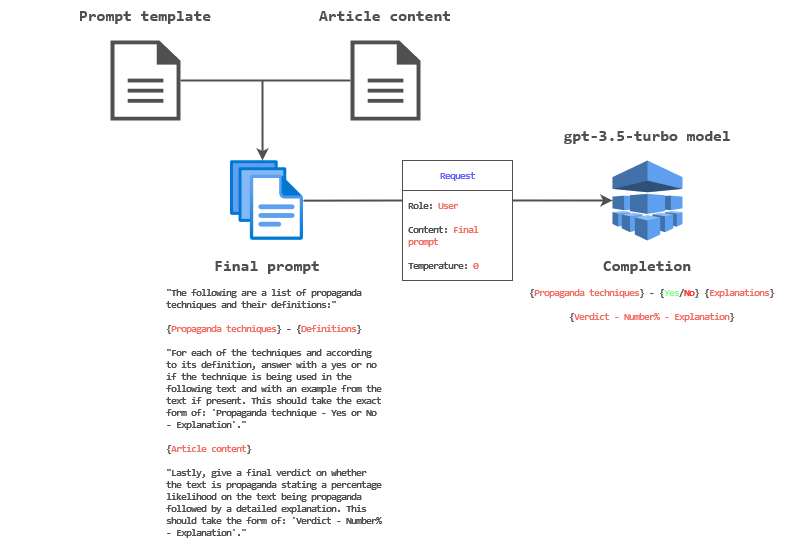

# # Detecting Propaganda in News Articles Using Large Language Models

In this work, we investigate the feasibility of using Large Language Models (LLMs) to detect propaganda in news articles.

To do so, we feed tailored prompts coupled with news articles from **Russia Today** (**RT**), a prominent state-controlled news network, into OpenAI's [**gpt-3.5-turbo**](https://platform.openai.com/docs/models/gpt-3-5) model.

## Procedure overview
At a high level, an iteration of the procedure looks as follows:

### Role & Content
The `role` and `content` properties of the request are required. There are three possible values for the `role`: `user`, `assistant`, and `system`. The `user` role is used to instruct the model, the `assistant` role can be used to store prior responses (to establish context), and the `system` role to set model behaviour (see [here](https://platform.openai.com/docs/guides/chat/introduction) for an extended description).

Currently, a single `user` message containing the final prompt is sent.

### Temperature
A higher `temperature` value can be used to "[make the output more random](https://platform.openai.com/docs/guides/chat/instructing-chat-models)" whilst a lower one (e.g., `0`) will cause the model to choose words with the highest probability of occurence. Since our goal is to receive responses that are as objective as possible, `0` is selected.

## Propaganda techniques
Martino et al. [1] define a list of 18 distinct propaganda techniques, which are as follows:
Technique | Definition
------ | ------
Name calling | Attack an object/subject of the propaganda with an insulting label  
Repetition | Repeat the same message over and over
Slogans | Use a brief and memorable phrase
Appeal to fear | Support an idea by instilling fear against other alternatives
Doubt | Questioning the credibility of someone/something
Exaggeration/minimization | Exaggerate or minimize something
Flag-Waving | Appeal to patriotism or identity
Loaded Language | Appeal to emotions or stereotypes
Reduction ad hitlerum | Disapprove an idea suggesting it is popular with groups hated by the audience
Bandwagon | Appeal to the popularity of an idea
Casual oversimplification | Assume a simple cause for a complex event
Obfuscation, intentional vagueness | Use deliberately unclear and obscure expressions to confuse the audience
Appeal to authority | Use authority’s support as evidence
Black&white fallacy | Present only two options among many
Thought terminating clichés | Phrases that discourage critical thought and meaningful discussions
Red herring | Introduce irrelevant material to distract
Straw men | Refute argument that was not presented
Whataboutism | Charging an opponent with hypocrisy

## References
[1] Martino, G. D. S., Cresci, S., Barrón-Cedeño, A., Yu, S., Di Pietro, R., & Nakov, P. (2020). A survey on computational propaganda detection. arXiv preprint arXiv:2007.08024